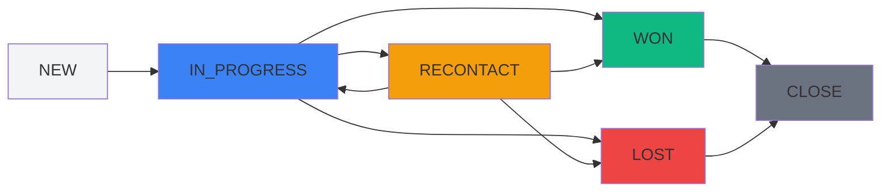

# Plan de Desarrollo - CRM Frontend

## 🎯 Objetivo
Desarrollar un frontend moderno para sistema CRM con dashboard completo y panel de gestión de requests estilo Trello, usando React + TypeScript + Tailwind CSS.

## 🎨 Diseño y Paleta de Colores

### Paleta Schnauzer Pimienta (Elegante)
```css
/* Grises principales */
--charcoal: #1F2937      /* Sidebar, headers */
--slate-dark: #374151    /* Backgrounds secundarios */
--slate: #4B5563         /* Texto principal */
--slate-light: #6B7280   /* Texto secundario */
--silver: #9CA3AF        /* Bordes, iconos */
--platinum: #D1D5DB      /* Bordes suaves */
--pearl: #F3F4F6         /* Backgrounds claros */
--white: #FFFFFF         /* Backgrounds principales */

/* Acentos mínimos */
--accent-blue: #3B82F6   /* Links, botones primarios */
--accent-green: #10B981  /* Estados positivos (won) */
--accent-red: #EF4444    /* Estados negativos (lost) */
--accent-yellow: #F59E0B /* Estados de atención (recontact) */
```

## 🏗️ Arquitectura del Proyecto

### Estructura de Carpetas
```
src/
├── components/           # Componentes reutilizables
│   ├── ui/              # Componentes base (Button, Card, etc.)
│   ├── layout/          # Layout components (Sidebar, Header)
│   ├── dashboard/       # Componentes del dashboard
│   └── kanban/          # Componentes del panel Trello
├── pages/               # Páginas principales
├── services/            # API services
├── hooks/               # Custom hooks
├── types/               # TypeScript types
├── utils/               # Utilidades
└── styles/              # Estilos globales
```

## 📊 API Integration

### Endpoints Principales
- `GET /api/v1/requests-information` - Lista paginada de requests
- `GET /api/v1/requests-information/summary` - Resumen por estados
- `PATCH /api/v1/requests-information/{id}/status` - Cambio de estado
- `GET /api/v1/requests-information/{id}/notes` - Notas de request

### Estados del Sistema
- **NEW** → Nuevas solicitudes
- **IN_PROGRESS** → En proceso
- **RECONTACT** → Recontactar
- **WON** → Ganadas
- **LOST** → Perdidas
- **CLOSE** → Cerradas (no mostrar en panel)

## 🖥️ Componentes Principales

### 1. Layout Principal
```
┌─────────────────────────────────────────────────────┐
│ Header (Search, User Avatar, Dropdown)             │
├─────────┬───────────────────────────────────────────┤
│ Sidebar │ Main Content Area                         │
│         │                                           │
│ - Dashboard                                         │
│ - Requests                                          │
│ - Reports                                           │
│ - Settings                                          │
└─────────┴───────────────────────────────────────────┘
```

### 2. Dashboard KPIs
- **Métricas Principales**: Total requests, conversión, revenue
- **Gráficos**: Tendencias temporales, distribución por estados
- **Actividad Reciente**: Últimas acciones, cambios de estado
- **Performance**: Tiempo promedio por estado, eficiencia

### 3. Panel Kanban (Estilo Trello)
```
┌─────────┬─────────┬─────────┬─────────┬─────────┐
│   NEW   │IN_PROG  │RECONTACT│   WON   │  LOST   │
├─────────┼─────────┼─────────┼─────────┼─────────┤
│ Card 1  │ Card A  │ Card X  │ Card M  │ Card Z  │
│ Card 2  │ Card B  │ Card Y  │ Card N  │         │
│ Card 3  │         │         │         │         │
└─────────┴─────────┴─────────┴─────────┴─────────┘
```

## 🔧 Dependencias Adicionales

### Librerías Requeridas
```json
{
  "dependencies": {
    "@dnd-kit/core": "^6.1.0",           // Drag & Drop
    "@dnd-kit/sortable": "^8.0.0",       // Sortable lists
    "@dnd-kit/utilities": "^3.2.2",      // DnD utilities
    "recharts": "^2.8.0",                // Gráficos
    "react-router-dom": "^6.20.0",       // Routing
    "axios": "^1.6.0",                   // HTTP client
    "react-query": "^3.39.0",            // Data fetching
    "@phosphor-icons/react": "^2.0.15",  // Iconos (Phosphor Icons)
    "clsx": "^2.0.0",                    // Conditional classes
    "date-fns": "^2.30.0"                // Date utilities
  }
}
```

## 🎯 Funcionalidades Específicas

### Dashboard
- **KPIs en tiempo real**: Contadores animados
- **Gráfico de tendencias**: Líneas temporales por estado
- **Distribución circular**: Pie chart de estados actuales
- **Tabla de actividad**: Últimos cambios con timestamps
- **Métricas de rendimiento**: Tiempo promedio por pipeline

### Panel de Requests
- **Vista Kanban**: 5 columnas (excluyendo CLOSE)
- **Drag & Drop con Confirmación**: Dialog de confirmación al cambiar estado
- **Validación de transiciones**: Solo permitir movimientos válidos entre estados
- **Filtros avanzados**: Por fecha, cliente, valor
- **Búsqueda en tiempo real**: En header principal
- **Cards informativas**: Cliente, valor, fecha, notas

### Header & Navigation
- **Buscador global**: Autocomplete con resultados
- **Avatar de usuario**: Imagen placeholder elegante
- **Dropdown menu**: Profile, Settings, Logout
- **Indicador de conexión**: Tag visual para estado offline/online
- **Breadcrumbs**: Navegación contextual

### Sidebar
- **Navegación principal**: Dashboard, Requests, Reports
## 🔧 Buenas Prácticas y Patrones

### Arquitectura de Componentes
- **Atomic Design**: Atoms → Molecules → Organisms → Templates → Pages
- **Composition over Inheritance**: Usar composición para reutilización
- **Single Responsibility**: Cada componente con una responsabilidad específica
- **Custom Hooks**: Lógica reutilizable extraída en hooks personalizados

### Patrones de Estado
- **Context API**: Para estado global (usuario, tema, configuración)
- **React Query**: Para estado del servidor (cache, sincronización)
- **Reducer Pattern**: Para lógica compleja de estado local
- **Optimistic Updates**: Para mejor UX en operaciones de red

### Performance Patterns
- **React.memo**: Memoización de componentes puros
- **useMemo/useCallback**: Optimización de cálculos y funciones
- **Code Splitting**: Lazy loading de rutas y componentes pesados
- **Virtual Scrolling**: Para listas largas de requests

### Error Handling
- **Error Boundaries**: Captura de errores en componentes
- **Try-catch**: Manejo de errores en async operations
- **Fallback UI**: Interfaces de respaldo para errores
- **Retry Logic**: Reintentos automáticos para operaciones fallidas

## 🌐 Sistema de Conectividad

### Indicador de Conexión
- **Hook personalizado**: `useNetworkStatus()` para detectar conectividad
- **Tag visual**: Indicador en header con estados:
  - 🟢 **Online**: "Conectado" (verde sutil)
  - 🔴 **Offline**: "Sin conexión" (rojo elegante)
  - 🟡 **Reconectando**: "Reconectando..." (amarillo)

### Manejo Offline
- **Queue de operaciones**: Almacenar cambios pendientes cuando offline
- **Sincronización**: Auto-sync cuando se recupera conexión
- **Feedback visual**: Indicar operaciones pendientes de sincronizar
- **Fallback data**: Mostrar datos en cache cuando no hay conexión

## 🎯 Sistema de Confirmación Drag & Drop

### Dialog de Confirmación
```typescript
interface StatusChangeConfirmation {
  fromStatus: RequestStatus;
  toStatus: RequestStatus;
  requestId: string;
  requestTitle: string;
}
```

### Flujo de Confirmación
1. **Drag Start**: Mostrar zonas de drop válidas
2. **Drag Over**: Highlight de columna destino
3. **Drop**: Mostrar dialog de confirmación
4. **Confirm**: Ejecutar cambio de estado via API
5. **Success**: Actualizar UI y mostrar feedback
6. **Error**: Revertir cambio y mostrar error

### Validaciones de Transición
- **NEW** → IN_PROGRESS, LOST ✅
- **IN_PROGRESS** → RECONTACT, WON, LOST ✅  
- **RECONTACT** → IN_PROGRESS, WON, LOST ✅
- **WON/LOST** → No permitir cambios ❌

## 📱 Iconografía con Phosphor Icons

### Iconos Principales
```typescript
import { 
  House,           // Dashboard
  Kanban,          // Requests Board
  ChartLine,       // Analytics
  MagnifyingGlass, // Search
  User,            // Profile
  Gear,            // Settings
  SignOut,         // Logout
  WifiHigh,        // Online
  WifiSlash,       // Offline
  ArrowsClockwise, // Sync
  CheckCircle,     // Success
  XCircle,         // Error
  Warning          // Warning
} from '@phosphor-icons/react';
```

### Convenciones de Uso
- **Tamaño estándar**: 20px para UI, 16px para inline
- **Peso consistente**: Regular para UI, Bold para estados importantes
- **Color semántico**: Seguir paleta de grises con acentos mínimos
- **Indicadores**: Badges con conteos en tiempo real
- **Diseño colapsible**: Para pantallas pequeñas
- **Estados visuales**: Active, hover, focus

## 📱 Responsive Design

### Breakpoints
- **Mobile**: < 768px (Sidebar colapsado)
- **Tablet**: 768px - 1024px (Sidebar compacto)
- **Desktop**: > 1024px (Sidebar completo)

### Adaptaciones
- **Mobile**: Stack vertical del Kanban
- **Tablet**: 3 columnas en Kanban
- **Desktop**: 5 columnas completas

## 🔄 Estados y Transiciones

### Animaciones Elegantes
- **Hover effects**: Sutiles elevaciones y cambios de color
- **Loading states**: Skeletons en tonos grises
- **Transitions**: 200ms ease-in-out para interacciones
- **Drag feedback**: Visual feedback durante arrastre

## 🚀 Performance

### Optimizaciones
- **Lazy loading**: Componentes y rutas
- **Memoización**: React.memo para componentes pesados
- **Virtualization**: Para listas largas de requests
- **Caching**: React Query para datos de API

## 🧪 Testing Strategy

### Componentes a Testear
- **API services**: Mocks de endpoints
- **Drag & Drop**: Simulación de interacciones
- **Dashboard**: Cálculos de métricas
- **Responsive**: Diferentes viewports

---

## 📋 Mermaid - Flujo de Estados



## 📋 Mermaid - Arquitectura de Componentes

```mermaid
graph TD
    A[App] --> B[Layout]
    B --> C[Header]
    B --> D[Sidebar]
    B --> E[MainContent]
    
    C --> F[SearchBar]
    C --> G[UserMenu]
    
    D --> H[Navigation]
    D --> I[StatusBadges]
    
    E --> J[Dashboard]
    E --> K[KanbanBoard]
    
    J --> L[KPICards]
    J --> M[Charts]
    J --> N[ActivityFeed]
    
    K --> O[KanbanColumn]
    O --> P[RequestCard]
    
    style A fill:#1f2937
    style B fill:#374151
    style J fill:#3b82f6
    style K fill:#10b981
```



Este plan proporciona una base sólida para desarrollar un CRM frontend elegante, funcional y escalable que cumple con todos tus requerimientos específicos.